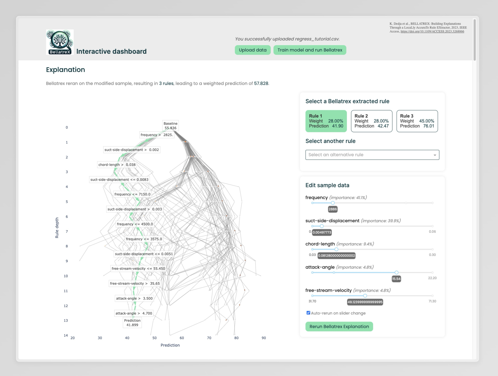

# Bellatrexplorer: Random forest explainability toolbox based on Bellatrex



## Installation
First of all, clone this repository in your place of preference:
```bash
git clone https://github.com/robbedhondt/BellatrExplorer
cd BellatrExplorer
```
To run Bellatrex, we require Python 3.9. For now, it is recommended to clone Bellatrex from git instead of installing it with pip, as we need the latest development version for this explorer tool to work. The easiest way to install and run the visualisation tool is to configure a python virtual environment with [venv](https://docs.python.org/3/library/venv.html).
```bash
python3.9 -m venv venv_btrexplorer
source venv_btrexplorer/bin/activate
```

Clone and install the Bellatrex repository.
```bash
git clone https://github.com/Klest94/Bellatrex.git
cd Bellatrex
pip install -e .
```

Now go back to the root directory and install the remaining required packages.
```bash
cd ..
pip install -r requirements.txt
```

## Run the app
From the root directory of this project, run the following:
```bash
cd src
python web_visualisation.py
```

The app will now be available on http://127.0.0.1:8050/.

## Future work
- Legend
    - P1 = very useful to have
    - P2 = would be nice
    - P3 = low priority
- General
    - P2: Add an optional UMAP visualisation that computes in the background. For each feature you can draw a line from the sample to where it would move in the visualisation if you change that feature in that way. You could also display the closest training sample somehow and indicate how far that one is from the current sample (to see how "out of distribution" you are).
        - Inverse UMAP: click a point on the UMAP and transform it back into a instance
    - P2: Better handling of dataset input: autoprocess categorical features (OHE if not castable to int), impute missing values... The datatable at the bottom should contain the "cleaned up" data, so the user can verify and compare to the uploaded data.
    - P2: Potential bug: user changes "target" after training; our program relies on value of "target" being associated to the currently trained random forest... Solution: save "target" as dcc.Store or as attribute of the `RandomForest` model? (even better: upon pressing the train button, write the full setup as a dictionary to a single dcc.Store)
    - P3: Look into TODOs around the script, e.g. optimize generate_rules
- Modeling
    - P3: Show more info: dataset descriptive statistics (n, p, ...), RF train and OOB performance (so user can assess overfitting)...
    - P3: Possibly integrate "dataset-selector" and "upload-dataset" more tightly?
        - One of the dropdown values could be "upload your own dataset..."
        - OR a "(custom dataset)" dropdown value could be added and set to "enabled": False so the user cannot select it themselves
- Instance selection
    - P2: Add a button to sort the features. Could be based on impurity (but doesn't work for survanal) or on permutation feature importances (based on out of bag error if that's possible?)
    - P3: Sliders could each have a checkmark button to make it "exponentially scaled"? See https://dash.plotly.com/dash-core-components/slider "Non-Linear Slider and Updatemode". Alternatively, autodetect skewness? (cfr Jasper SurvivalLVQ)
    - P2: Maybe show the delta on the slider tracks instead of absolute value?
    - P2: Evenly space the dots on the sliders? So the values for the slider are actually the percentiles? And the value that is shown could then be the actual feature value... somehow we need to incorporate categorical variables then though. Also we would lose some interpretability of the feature distributional information and its raw value (compared to the rules that say "age > 72" for example)
        - Add also this to a config file
- All rules graph
    - P3: set max rule depth: through callback with fig.update_yaxes(range=[None, value])
    - P2: Add a legend and selector that would highlight all the rules based on one particular feature (similar to the feature selector in univariate feature effects graph)
    - P2: Add colorbar (as a reference point for instance selection)
    - P2: Add previous splits to the tooltip of the hovered node (see documentation [dcc.Tooltip](https://dash.plotly.com/dash-core-components/tooltip)). See if this does not conflict with `config.TOOLTIP_PREVIOUS_SPLIT`.
    - P2: Force graph xlim to the range of all the predictions made by the RF? Or not??
    - P2: Somehow indicate the current prediction (vertical dotted line, as in btrex)
    - P3: Implement something for the lasso select? Highlight all rules in the selection?
- Univariate feature effects graph
- Bellatrex graph
    - P1: Adapt generated figure size
    - P2: Use older bellatrex graph implementation? That can be packaged along with this repo? (the alignment with the arrow at the bottom is not always perfect...)
- Data table
    - P3: https://dash.plotly.com/datatable table click callback so if you click one of the rows in the datatable it's highlighted and the slider values are changed to it?
```python
    # TODO: write a demo app with 3 buttons to truly test the difference of these
    #       three methods
    # MODEL HANGING AROUND (with the line `rf = defaults["model"]`)
    # - Total 365 ms (compute 196, network 169)
    # - Data transfer
    #   download: 2271298
    #   upload:   1856500
    # MODEL SERIALIZED
    # - Total 941 ms (compute 533, network 407)
    # - Data transfer
    #   download: 2328515
    #   upload:  29270904
    # MODEL FROM STORAGE CACHE
    # - Total 485 ms (compute 270, network 215)
    # - Data transfer
    #   download: 128057
    #   upload  : 1326
    # rf = defaults["model"]
```

References
- [Folder structure](https://community.plotly.com/t/structuring-a-large-dash-application-best-practices-to-follow/62739)
- [Devtools doc](https://dash.plotly.com/devtools)

## Paper guidelines
- Submissions should describe working systems based on state-of-the-art machine learning and data mining technology. Systems should demonstrate that they go beyond basic statistics and leverage machine learning techniques and knowledge discovery processes in a real setting.
- The paper must provide adequate information on the system's components and the way the system is operated, including, e.g., screenshots and a use case.
- Authors should remember that the description of a demo has inherently different content than a research paper submitted to the main conference. A successful demonstration paper should tackle the following questions
    - What are the innovative aspects, and in what way/area does it represent the state of the art?
    - Who are the target users, and why is the system interesting/useful to them?
    - If there are similar/related pieces of software, what are the advantages and disadvantages of the one presented?
- A demonstration submission can be up to four pages long, including references. 
- The paper should contain a URL linking to a demonstration video of at most 5 minutes. This video should show and explain the execution of the system as it will be done at the conference. It may be a mixture or combination of a demo, voice-over (Powerpoint, PDF slides, etc.), and screencast presentations showing and explaining what happens. It should include subtitles in English.

## Related work
- [An Interactive Visual Tool to Enhance Understanding of Random Forest Predictions](https://web.archive.org/web/20210312061825id_/https://publikationen.bibliothek.kit.edu/1000130424/105524939)
    - Manipulate selected features to explore "what-if" scenarios
    - Local surrogate tree as explanation for the prediction
    - Recommendation for reassignment of feature values of the example that leads to change in the prediction to a preferred class
    - This is probably the closest paper to our work
- [RfX: A Design Study for the Interactive Exploration of a Random Forest to Enhance Testing Procedures for Electrical Engines](https://onlinelibrary.wiley.com/doi/pdfdirect/10.1111/cgf.14452?download=true)
    - Global explainability
    - Icicle plots, investigate trees
    - User study
- [iForest: Interpreting Random Forests via Visual Analytics](https://ieeexplore.ieee.org/stamp/stamp.jsp?tp=&arnumber=8454906)
    - User study
    - Both global and local
    - Local doesn't seem very useful? "decision path view"
- [Interactive Random Forests Plots](https://digitalcommons.usu.edu/cgi/viewcontent.cgi?article=1148&context=gradreports)
    - Master thesis
    - Aimed at larger datasets
    - Parallel coordinates and multidimensional scaling
- [Rfviz: An Interactive Visualization Package for Random Forests in R](https://digitalcommons.usu.edu/cgi/viewcontent.cgi?article=2360&context=gradreports)
    - Same as master thesis above
- [Visualisation of Random Forest classification](https://journals.sagepub.com/doi/full/10.1177/14738716241260745)
    - class distribution per feature and per depth in the tree? not following entirely what is shown in figure 1
    - figure 3 pyramid matrix for feature interaction looks quite cool
