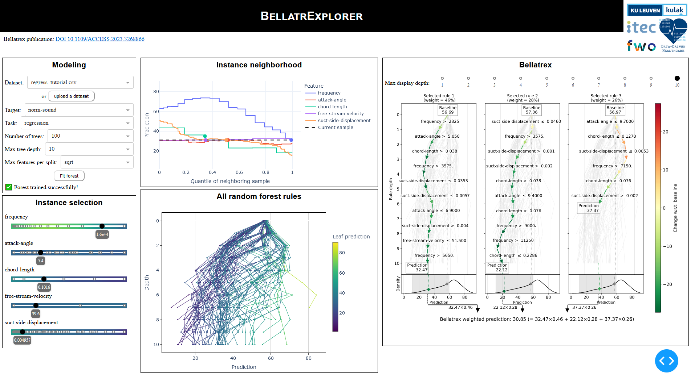

# BellatrExplorer: Random forest explainability toolbox based on [Bellatrex](https://github.com/Klest94/Bellatrex)



## Installation (for local usage)
First of all, clone this repository in your place of preference:
```bash
git clone https://github.com/robbedhondt/BellatrExplorer
cd BellatrExplorer
```
To run [Bellatrex](https://github.com/Klest94/Bellatrex), we require Python 3.9. The easiest way to install and run the visualisation tool is to configure a python virtual environment with [venv](https://docs.python.org/3/library/venv.html).
```bash
python3.9 -m venv venv_btrexplorer
source venv_btrexplorer/bin/activate
```

Now we can install the required packages.
```bash
pip install -r requirements.txt
```

## Run the app
From the root directory of this project, while the virtual environment is active, run the following:
```bash
python src/app.py
```

The app will now be available on http://127.0.0.1:8091/.
